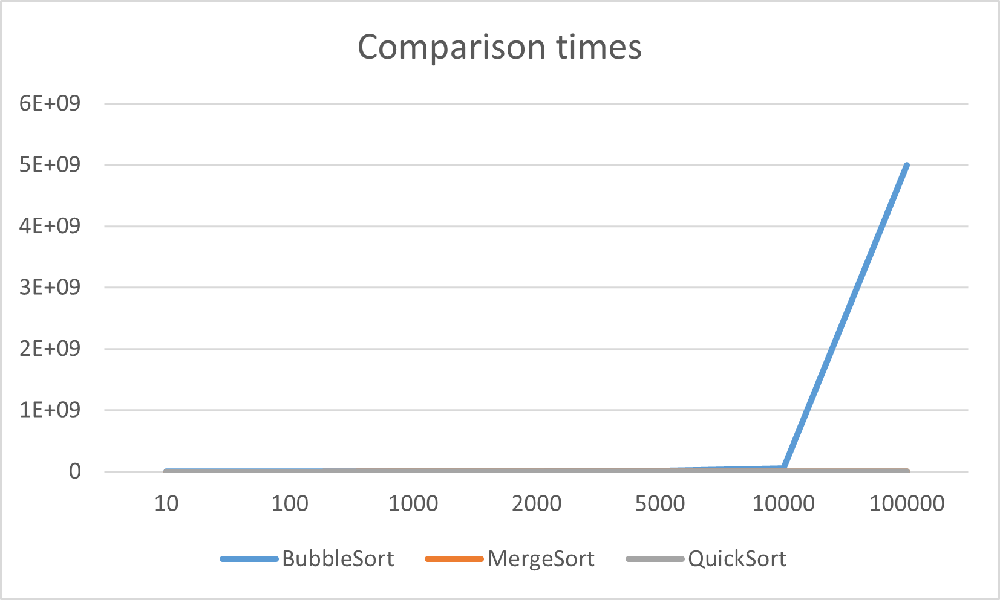
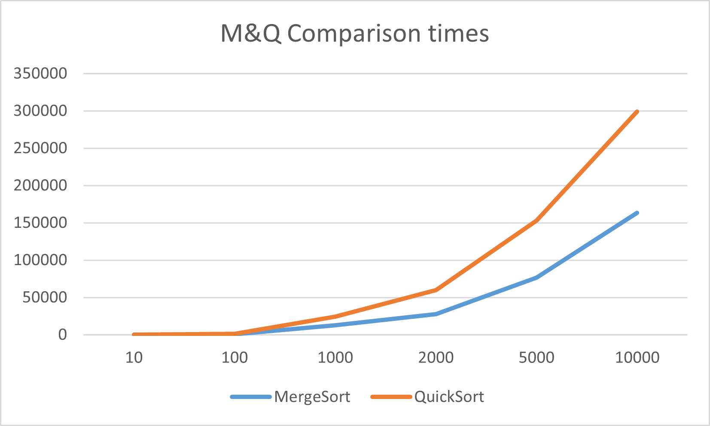
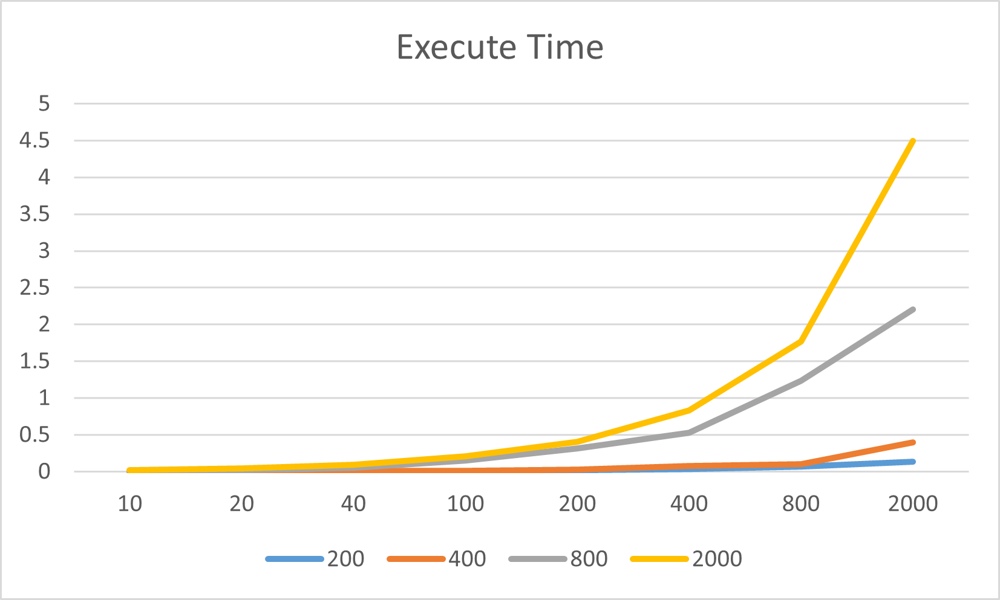
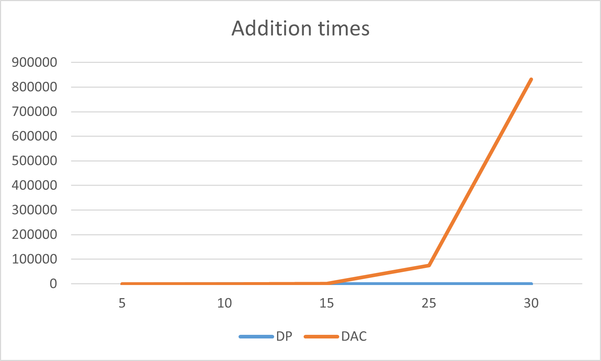
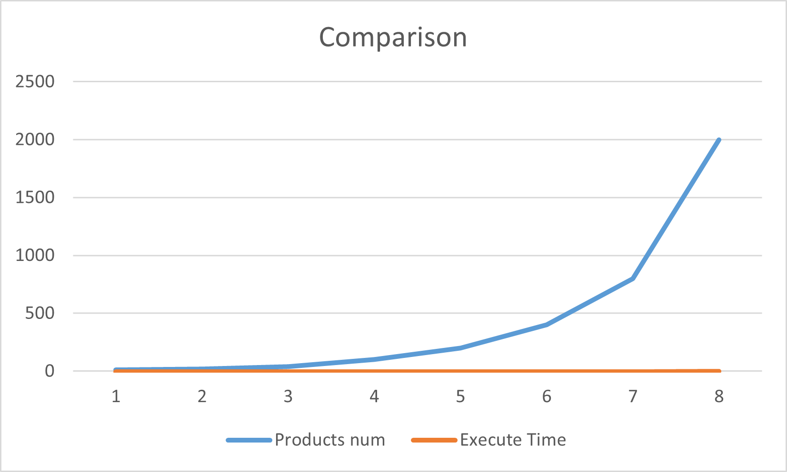

# 算法分析与设计实验报告

## 学号：20201060459

## 实验目的：

>1. 实验一
>>通过排序算法的程序实现和执行时间测试，与理论上的结论进行对比分析，深入理解算法时间复杂度渐进性态和和增长率的概念；理解分治算法设计的基本思想、递归程序实现的基本方法，加深对分治算法设计与分析思想的理解。

>2. 实验二
>>1.编程实现经典的动态规划算法，理解动态规划算法设计的基本思想、程序实现的相关技巧，加深对动态规划算法设计与分析思想的理解。通过程序的执行时间测试结果，与理论上的时间复杂度结论进行对比、分析和验证。
>>2.对于同一问题，编程实现其分治算法和动态规划算法，通过对比分析，理解动态规划算法的适用情形。通过程序的执行时间测试结果，与理论结论进行对比、分析和验证。

>3.实验三
>>编程实现经典的贪心算法，理解贪心算法设计的基本思想、程序实现的相关技巧，加深对贪心算法设计与分析思想的理解。通过程序的执行时间测试结果，与理论上的时间复杂度结论进行对比、分析和验证


## 实验原理

### 实验一
>1算法时间复杂度分析的相关概念
>>算法的计算时间取决于算法中某些操作的执行次数，这些操作是算法时
>>间复杂度分析的依据。增长率反映了算法的计算时间复杂度，即随着算法输入规模的增加、算法计算时间增加的趋势。算法的计算时间复杂度针对输入数据的等价类来分析或测试。

>2 随机数生成算法
>>通过程序生成（伪）随机数，作为实验用测试数据。可使用编程语言自带的random 函数生成，也可以采用一些有效的随机数生成算法生成，例如“线性同余法”，基于该算法，只要参数选择合适，所产生的伪随机数就能满足均匀性和独立性，与真正的随机数具有相近的性质。该算法的基本思想如下：通过设置 Xi+1=(aXi+c) mod m, n≥0，其中的 4 个整数参数：
>>m——模数, m>0；a——乘数, 0≤a<m c——增量, 0≤c<m；X0——开始值, 0≤X0<m。这样得到所求的随机数序列{Xi}，称作线形同余序列。

>3.分治算法
>>分治算法的基本思想是将一个规模为 n 的问题分解为 k 个规模较小的子问题，这些子问题相互独立且与原问题性质相同。求出子问题的解，就可得到原问题的解。分治算法设计的一般步骤包括：
>>>1. 分解，将要解决的问题划分成若干规模较小的同类问题；
>>>2. 求解，当子问题划分得足够小时，用较简单的方法解决；
>>>3. 合并，按原问题的要求，将子问题的解逐层合并构成原问题的解。
>>>4. 基本设计规范
>>>>DivideAndConquer(data,n,solution)<br />
>>if(n≤SizeLimit) then <br />
>>DirectSolution(data,n,solution) <br />
>>else <br />
>>DivideInput(data,n,smallerSets,smallerSizes,numberSmaller) <br />
>>for i=1 to numberSmaller do <br />
>>DivideAndConquer(smallerSets[i],smallerSizes[i],smallerSolution[i]) <br />
>>end for <br />
>>CombineSolutions(smallerSolution,numberSmaller,solution) <br />
>>end if `   

### 实验二
>1.动态规划算法的基本思想
>>动态规划是一种在数学和计算机科学中使用的、用于求解包含重叠子问题的最优化问题的有效方法。其基本思想是：将原问题分解为相似的子问题，在求解的过程中通过子问题的解描述并求出原问题的解。动态规划的思想是多种算法的基础，被广泛应用于计算机科学和工程领域，在查找有很多重叠子问题的情况的最优解时有效。它将问题重新组合成子问题，为了避免多次解决这些子问题，它们的结果都逐渐被计算并保存，从小规模的子问题直到整个问题都被解决。因此，动态规划对每一子问题只做一次计算，具有较高的效率。

>2.分治算法与动态规划算法的对比：针对子问题是否重叠
>>虽然很多问题均可分解为子问题、动态规划和分治算法都是通过子问题的解决来获得原问题的解。然而，分治算法适用于子问题不重叠（即相互独立）的情形，对于子问题重叠的情形分治法具有较高的时间复杂度，动态规划是针对这类情形的有效算法。
### 实验三
>1.贪心算法的基本思想
>>贪心算法求解优化问题的基本思想是：采用逐步构造最优解的方法。在每个阶段，都作出一个当前最优的决策（在一定的标准下）。决策一旦作出，就不可再更改（作出贪心决策的依据称为贪心准则）。贪心算法的一般步骤如下：
>>>(1) 根据拟解决问题选取一种贪心准则；
>>>(2) 按贪心准侧标准对 n 个候选输入排序（以这一方法为代表，仍可基于堆来存储候选）；
>>>(3) 依次选择输入量加入部分解中：如果当前这个输入量的加入，不满足约束条件，则不把此输入加到这部分解中。

>2.贪心算法的基本设计范式如下：
>>>Greedy(A,n) 
>>>A: include n inputs 
>>>Solution=Ф
>>for i=1 to n do 
>>> x=Select(A) 
>>> if Feasible(solution,x) then 
>>> solution=Union(solution,x) 
>>> end if 
>>>end for 
>>>return solution 


## 实验输入数据集
>### 实验一
>>实验一中用到的数据集均为代码随机生成，无特殊数据使用

> ### 实验二
>>在实验二中所用到的数据集均为代码随机生成，无特殊数据使用

>### 实验三
>>在实验三中所用到的数据集均为代码随机生成，无特殊数据使用


## 实验内容
>各实验详细带注释代码：
>1. [实验一代码](AlgorithmChap1Ti1.py)
>2. [实验二-第一题代码](AlgorithmChapt2Ti1.py) 
>3. [实验二-第二题代码](AlgrothimChapter2Ti2Fibonacci.py)
>4. [实验三代码](AlgorithmChap3Ti1Greedybag.py)

## 实验预期结果与实际结果
### 实验一
>1.实验预期结果：
>>1.编程实现几个排序算法，并且实现对其内部中比较次数的计数

>>2.使用报告中要求的随机生成方法，生成包含一百个数据的数据集，比较两次生成的测试数据和算法执行中比较操作的次数，理解算法复杂度分析时输入数据等价类的含义

>>3.使用随机数生成方法生成不同规模的测试数据，并且绘出折线图，与时间复杂度的理论结论对比分析，理解计算时间渐进性态和增长率的概念。

>>4.在 MergeSort 和 QuickSort 算法中设置比较操作执行的全局计数器，编程实现算法（输出最终的计数值）；设置记录每次递归调用时描述问题规模的变量，程序结束时输出其值。对于每种规模的测试数据，分别记录以上两个算法执行中各子问题的规模，并用表格方式记录所有情形各子问题的规模值.

>>5.分析总结解题心得

>2.实际结果
>>成功根据需求编写了题目代码，见文件：[实验一代码](AlgorithmChap1Ti1.py)

>>1.根据实验讲义，成功编写了冒泡排序、快速排序和归并排序，并且成功的完成了对内部比较次数的计算。

>>2.应照讲义中的要求，完成了随机数生成算法的编写。并且，通过数据集的比较，得出心得体会：
>>>在分析算法的时间复杂度时，得出的结果其实是与数据集的构成有关系，不同的数据集可能得出不同的结果。实验时，应该尽可能的选用等价类数据集，并且得出的结果也应明白是基于此类数据集的。

>>3.根据题目要求，生成了算法比较次数曲线图：
>>>
>>>
>>>通过分析曲线图可知：
>>>    首先，通过课程学习我们可以知道，算法的时间复杂度，是一个用于度量一个算法的运算时间的一个描述，本质是一个函数，根据这个函数能在不用具体的测试数据来测试的情况下，粗略地估计算法的执行效率，换句话讲时间复杂度表示的只是代码执行时间随数据规模增长的变化趋势。计算时间的渐进形态是指当算法的输入数据大于一定大小后，算法的时间复杂度会趋近于某一个表达式。也即它在图标中会有一条渐进线，获得它的渐进性态。而算法的增长率是指算法的时间消耗的增长速度。可以直观的体现出算法的时间消耗随着数据集大小变化的增长情况

>>4.通过在 MergeSort 和 QuickSort 算法中设置比较操作执行的全局计数器，得到了两种算法的准确的子问题规模大小
>>[SubproblemScaleDocument](Subproblemscaledocument)

### 实验二
>1.实验预期结果：
>>题目1：
>>>1.编写代码实现题目所述代码，并且设置计算程序运行时间的代码。

>>>2.计算不同C值下不同n值增加带来的时间消耗的增加，并且绘制程序执行时间对比曲线图。

>>>3.与理论上的时间复杂度结论进行对比分析，完成实验报告。

>>题目二
>>>1.编写题目代码，并且在两个算法中都添加加法执行次数的计数器。

>>>2.测试不同n值下两个算法的表现，并且做出对比曲线图。

>>>3.与两个算法时间复杂度的理论结论进行对比分析，总结分治与动态规划算发的适用条件和特点，完成实验报告

>2.实验结果：
>>首先是根据题目要求，成功编写了代码:[实验2.1代码](AlgorithmChapt2Ti1.py),[实验2.2代码](AlgrothimChapter2Ti2Fibonacci.py)

>>题目1:
>>>1.根据要求，完成了代码编写，并且实现了对算法执行时间的记录和输出。

>>>2.根据要求，测试了在对于C=200、400、800、2000 这四种情形下，再生成 n 个随机数作为 n 个物品的价值（n=10, 20, 40, 100, 200, 400, 800, 2000）带入算法中进行计算，并且绘制出来了不同C值下程序执行时间的对比曲线图。
>>>

>>>3.理论上的时间复杂度为O(nC)，观察曲线图发现实际运行时间吻合理论。通过这一题的实验，增强了自己的动态规划算法的理解，锻炼了自己代码编写能力。可以说是对自己的理论课上学习的知识的领悟有进一步提升。让自己不仅仅学会思想，更是学会了实际的代码编写。

>>题目二:
>>>1.完成了题目中两个算法代码的编写，设置了加法操作执行计数器。

>>>2.完成了在不同n值下的算法加法次数的测试和记录，并且绘制出了两个算法的加法曲线对比图。
>>>

>>>3.在实验完成以后，通过分析解决的题目，总结出来了分治法与动态规划法算发的适用条件和特点：
>>>>分治法：
>>>>>分治法的特点是分个治之，逐个击破。分治法一般用于解决可以将问题规模不断缩小的问题。在使用条件方面，需要其子问题需要相互独立，并且可以通过合并子问题的解得出原问题的答案。

>>>>动态规划法：
>>>>>其特点是子问题的解一旦确定就不再改变，并且它解决的问题的子问题一般具有重叠性质，也即产生的子问题有一部分是在前面已经计算过的。因此，动态规划法利用其对已计算出的子问题的记录，可以高效的解决具有最优子结构性质的问题。

### 实验三
>1.实验预期结果：
>>1.完成题目中所给算法KnapsackGreedy，并且增加计算算法运行时间的代码。

>>2.编写代码实现设定一个 m 值，测试随着 n 增加、程序执行时间增加的趋势。生成 n 个随14机数作为 n 个物品的价值，并且记录随着 n增加程序的执行时间的变化，作出相关对比曲线图。

>>3.与理论上的上的时间复杂度结论进行对比分析，完成实验报告。

>2.实验结果：
>>1.成功的根据伪代码编写出了具有计算运行的时间的程序代码，经过测验，代码编写正确，运行结果无误。

>>2.根据题目要求，设定了背包大小M=100。接着，利用编写的算法生成 n 个随机数作为 n 个物品的重量，再生成 n 个随机数作为 n 个物品的价值（n=10, 20, 40, 100, 200, 400, 800, 2000）。最后，记录下了他们的执行时间，并且成功绘制出了图片。
>>

>>3.理论上本题的贪心算法时间复杂度为 O(nlogn)，观察测试数据可知，在m稍大一些后，运行时间基本符合该理论数值。从这个题我们可以看出，在数据量较小时，使用贪心算法可以较快、较简单的得出接近正确答案的运行结果。


## 实验总结与反思
>    在这一次的算法分析与设计课程实验中，我认为自己理论课的学习成果得到了极大的提升，在解决讲义问题的过程中，我不断进步不断发现问题。
> 在完成实验一的过程中，我先是复习了在课程中学习到的分治法的理论思想，分析了它的使用条件和算法特点，接着，我又在编写代码的过程加强我对分治算法的领悟。实实在在的敲击键盘，让我真真实实的将算法的思想吃透，也让自己的编程水平得到进一步的提升。而且在遇到代码出现BUG时，也能通过自己的思考去解决，锻炼了自己的动手能力，让自己收获颇丰。

>在完成实验二动态规划算法时，两个讲义题目都提升了我的代码编写能力。 第一题帮助我更好的厘清了动态规划算法的基本思想以及如何实现和时间复杂度的理解。第二题这是让我在解决实例问题中，加深对动态规划算法特点和适用范围的理解，通过与分治法的对比让我有了更好的思考。总的来说，我在实验二中通过动手编写代码来提升了我的对动态规划算法的理解和领悟。

>实验三中的贪心算法，可以说是三个实验中最简单的算法--贪心法，在完成的过程中我同样收获了很多。一是更好更具体的理解了它的思想，二是在实验中发现它的高效。特别是它在解决数据量简单的问题时，展现出来的性价比十分高。


## 实验过程及实验结果（Python版）

>实验一
```
[Running] python -u "/workspace/homewrok_template/AlgorithmChap1Ti1.py"
初始列表[149, 502, 393, 151, 20, 145, 499, 372, 4, 33, 236, 94, 142, 478, 225, 17, 124, 352, 385, 95]
冒泡排序结果[4, 17, 20, 33, 94, 95, 124, 142, 145, 149, 151, 225, 236, 352, 372, 385, 393, 478, 499, 502]
冒泡排序比较次数：190
合并排序结果[4, 17, 20, 33, 94, 95, 124, 142, 145, 149, 151, 225, 236, 352, 372, 385, 393, 478, 499, 502]
合并排序比较次数：146
合并排序子问题规模[19, 9, 4, 2, 1, 0, 0, 0, 1, 0, 0, 4, 2, 1, 0, 0, 0, 1, 0, 0, 9, 4, 2, 1, 0, 0, 0, 1, 0, 0, 4, 2, 1, 0, 0, 0, 1, 0, 0]
快速排序结果[4, 17, 20, 33, 94, 95, 124, 142, 145, 149, 151, 225, 236, 352, 372, 385, 393, 478, 499, 502]
快速排序比较次数：175
快速排序子问题规模[19, 8, 2, 1, 0, 5, 0, 4, 3, 2, 1, 0, 0, 0, 10, 0, 9, 3, 1, 1, 5, 0, 4, 1, 2, 1, 0]

[Done] exited with code=0 in 0.062 seconds

```
>实验二
```
题目一：
[Running] python -u "/workspace/homewrok_template/AlgorithmChapt2Ti1.py"
[125, 215, 468, 155, 48, 341, 308, 77, 23, 166]
[0, 0, 0, 0, 0, 0, 0, 0, 0, 0, 0]
[0, 0, 0, 0, 0, 0, 0, 0, 0, 0, 0]
[0, 0, 0, 0, 0, 0, 0, 0, 0, 0, 0]
[0, 0, 0, 0, 0, 0, 0, 0, 0, 0, 0]
[0, 0, 0, 0, 0, 0, 0, 0, 0, 0, 0]
[0, 0, 0, 0, 0, 0, 0, 0, 0, 0, 0]
[0, 0, 0, 0, 0, 0, 0, 0, 0, 0, 0]
[0, 0, 0, 0, 0, 0, 0, 0, 0, 0, 0]
[0, 0, 0, 0, 0, 0, 0, 0, 0, 0, 0]
[0, 0, 0, 0, 0, 0, 0, 0, 0, 0, 0]
程序运行时间：0.00010085105895996094

[Done] exited with code=0 in 0.066 seconds
```

```
题目二：
[Running] python -u "/workspace/homewrok_template/AlgrothimChapter2Ti2Fibonacci.py"
10
DP 结果：[0, 1, 1, 2, 3, 5, 8, 13, 21, 34, 55]
DAC 结果：[0, 1, 1, 2, 3, 5, 8, 13, 21, 34, 55]
DP 加操作此次数：[9]
DAC 加操作此次数：[54]

[Done] exited with code=0 in 0.061 seconds
```

>实验三
```
[Running] python -u "/workspace/homewrok_template/AlgorithmChap3Ti1Greedybag.py"
[0, 0, 0, 0.4, 0, 0, 0, 0, 0, 0, 0, 0, 0, 0, 0, 1, 0, 0, 0, 0, 0, 0, 0, 1, 0, 0, 0, 0, 0, 0, 0, 0, 0, 0, 0, 0, 0, 0, 0, 0, 0, 0, 0, 0, 0, 0, 0, 1, 0, 0]
程序运行时间：3.4332275390625e-05

[Done] exited with code=0 in 0.063 seconds

```
